Incremental Regular Expressions
===============================

*By Eugene Kirpichov <ekirpichov@gmail.com>*

*Code available at github:* http://github.com/jkff/ire

This article was originally published in the Russian functional programming
journal http://fprog.ru/ and this translation was intended to be published
in Peter Seibel's http://codequarterly.com/ journal, but as Peter eventually decided not
to proceed with the journal, I am publishing it on my personal space.

I would like to thank Peter for his multitude of extremely valuable comments that have
helped me greatly improve the clarity and flow of the article.

Introduction
------------

The problem of regular expression matching is a well-known one, with a
multitude of solutions.

The corresponding algorithms are very
beautiful, motivating many curious programmers to write their own regular
expression engines for fun.

The approaches to this problem are quite different in their area of
application. Here are some questions that the developer of an engine
has to answer.

* **Supported operators**: capturing groups, backreferences,
  execution of arbitrary code, greedy matching? The more features
  are supported, the harder it is to implement the engine
  efficiently; most of the features rule out whole classes of
  matching algorithms.

* **Number and kind of regular expressions:** How many regexes shall
  we test for? How big shall
  they be? Shall they be small expressions for data validation, or
  are we talking about a full-fledged lexer with dozens of tokens
  specified by their regular expressions?

* **Pattern of usage:** How many times is matching against a single expression
  performed? Is it OK to spend a lot of time compiling it but match
  very quickly afterwards?

* **Size of change of matched text:** How big is the matched text and how often does it change?

Let us list some of the existing approaches and engines.

* ``awk``, ``grep``, `re2 <http://code.google.com/p/re2/>`_ use the so called “automata-theoretic”
  approach, which allows them to guarantee linear matching time, 
  however some features (for example, backreferences) cannot be 
  implemented at all within their approach, and others (such as
  capturing groups) are quite hard to implement efficiently.
  
  Also, with this approach it is difficult to control memory overhead
  while retaining high efficiency — even re2 at times suffers
  from exponentially large memory consumption, though it is designed
  to avoid such situations.

  Besides, this approach allows for certain curious uses, for example,
  re2 uses automata theory to compute the minimal and maximal possible
  strings matching the regular expression, thus making Google Code Search
  possible by greatly reducing the amount of code to be actually matched
  against the expression when processing a query.

* Modified automata-theoretic approach, “tagged” automata:
  `libtre <http://laurikari.net/tre>`_,
  `regex-tdfa <http://hackage.haskell.org/package/regex-tdfa>`_
  — linear matching time is also
  guaranteed; it is possible to do approximate search;

* Semiring-based approach: `weighted-regexp <http://sebfisch.github.com/haskell-regexp>`_
  — also linear
  matching time and constant memory consumption; a very simple,
  beautiful and efficient implementation;

* Recursive descent: most of the other engines (Perl and
  PCRE-compatible engines, Java, irregexp etc.)—the whole range
  of features, but “pathological” cases are possible where
  matching time sharply increases.

In a fantastic `blog post <http://blog.sigfpe.com/2009/01/fast-incremental-regular-expression.html>`_ 
Dan Piponi [#f1]_ outlined yet another approach using monoids and finger trees.

This approach only works for “true” regular expressions (i.e. we
only have character classes, braces and the operators *+, \*, ?,
|*) but it allows to perform the matching **incrementally**: after small
changes of the input string we can recompute the result very quickly
without scanning the whole string. These changes include concatenating
two strings and cutting a string in two pieces. Obviously these two
operations form a basis for many others (insertion into the middle,
appending or prepending a character etc).

In this article we further develop Piponi's approach, which employs a 
number of beautiful algorithmic techniques from the world of functional 
programming, to build a Java library for incremental regular expression 
matching. This is also an interesting investigation into how the 
functional approach blends together with an imperative language.

There were several reasons to choose Java:

* Increase the probability that this library will be indeed used and
  will not remain a purely academical toy because of difficulties
  with its integration with existing projects;

* Facilitate understanding of the presented ideas for the
  (currently) quite broad community of imperative programmers;

* Show that studying the functional ideas and approaches is fruitful
  also for programming in non-functional languages.

Where could such an approach to regular expression matching be useful?

* The ability to quickly recompute the result after changes of the
  input string would be useful in text editors for incremental
  highlighting of arbitrary syntax, with tokens specified by their
  regular expressions (vim, for instance, allows rather flexible
  definition of syntax rules, but does not always do the
  highlighting and re-highlighting correctly, because it uses a
  rather naive approach to highlighting).
  
  Unfortunately, the engine
  developed in this article has performance characteristics that
  do not allow it to serve this purpose — however, not all hope is
  lost: some possible improvements will be outlined.

* One could imagine a problem in bioinformatics where one assembles
  a DNA sequence, say, using a genetic algorithm, from some “basis”
  sequences using glue and scissors (concatenations and cuts), and
  optimizes a function depending on the presence and position of
  particular patterns in the sequence.

Problem statement
^^^^^^^^^^^^^^^^^

The problem that we're going to solve is incremental matching of strings
against regular expressions. There are several ambiguities to resolve here,
however. Let us outline the major features of our engine: they are
basically the same as those in Dan Piponi's article.

* **The regular expression (or set of regular expressions) is fixed:**
  once we fix the expressions, we obtain a way to do incremental
  matching of strings against them.

* “Incremental” means “match result is efficiently maintained under
  certain operations”, where the operations include **concatenating
  two strings and splitting a string in part around an index**.
  Obviously, these two operations form a basis for all kinds of 
  rearrangements, such as inserting or deleting a word from the 
  middle of a string, or appending characters to its back or front,
  etc.

There is one more ambiguity to resolve: whether to make the “incremental”
interface pure or impure in the mathematical sense: whether concatenation
and splitting modify their arguments or create new results.

We choose the **pure** option (concatenation and splitting are mathematical
functions), because, as it is the case with nearly any kind of data 
structures having both a “pure” and “impure” implementation, it turns 
out dramatically easier to reason about mathematically and declaratively, 
and also dramatically easier to implement, debug and test. We shall 
elaborate more on the importance of this design decision in the 
section 'The importance of purity' section.

The automata-theoretic approach
-------------------------------

The most well-known approach to regular expression matching is based
on finite automata and is studied in most university courses on
compiler construction. You can throuroughly familiarize yourself with
it, for example, in `the article <http://swtch.com/~rsc/regexp/regexp1.html>`_ by Russ Cox. Let us
provide just a quick refresher of the most basic concepts of how
finite automata are used for matching text. Incrementalization will
follow in a surprisingly simple fashion.

Constructing the automaton
^^^^^^^^^^^^^^^^^^^^^^^^^^

Given a regular expression, one uses, for example, the “Thompson’s
construction” (due Ken Thompson), and builds a
finite automaton where one state is declared “initial”, one is declared 
“final” (though in theory nothing prevents having more than one initial 
or final state, and we shall use this opportunity in our algorithm), 
and some states are connected to each other by
edges.

An edge from :math:`A` to :math:`B` with subscript :math:`c`
means: “If state :math:`A` is active and the character :math:`c` is
input, then state :math:`B` becomes active instead of :math:`A`”. There
are also ε (epsilon)-edges: if :math:`A` is connected to :math:`B` by an
ε-edge, then, upon activation of :math:`A`, :math:`B` is also
immediately activated.

Epsilon edges are needed, for example, when 
constructing an automaton for the “?” (“optional”) construction: given
an automaton for R, you can insert an epsilon transition from the initial 
to the final state, giving an automaton for “R?”. 
If no edge from state :math:`A` fits the input, then
it is simply deactivated.

The automaton is called “non-deterministic”
because, given a state and a character, you can’t determine which edge 
to follow, because there can be several of them. Instead, you follow 
all of them at once and therefore, at any given moment, several states
may be active.

The matching process
^^^^^^^^^^^^^^^^^^^^

To perform matching, the initial states are activated and each
character of the sequence is fed as input in turn. If in the end at
least one “final” state is active, then the matching is declared
successful.

**Example.** The regular expression “``.*a(b*a|bc+)a``”.

An automaton for this expression is shown on the picture below
(somewhat simplified with respect to the Thompson's construction, by 
removing several redundant nodes and epsilon edges),
and here is the sequence of its active states upon feeding it with the
string “``aabcca``”.

.. figure:: images/nfa.png
  :align: center

  A non-deterministic automaton for the regular expression “``.*a(b*a|bc+)a``”

+--------------------+--------------------------------------+
| String seen so far | Active states                        |
+--------------------+--------------------------------------+
|                    | :math:`s_1`                          |
+--------------------+--------------------------------------+
| **a**              | :math:`s_1, s_2, s_3, s_4`           |
+--------------------+--------------------------------------+
| a **a**            | :math:`s_1, s_2, s_3, s_4, s_5, s_8` |
+--------------------+--------------------------------------+
| aa **b**           | :math:`s_1, s_3, s_6`                |
+--------------------+--------------------------------------+
| aab **c**          | :math:`s_1, s_6, s_7, s_8`           |
+--------------------+--------------------------------------+
| aabc **c**         | :math:`s_1, s_6, s_7, s_8`           |
+--------------------+--------------------------------------+
| aabcc **a**        | :math:`s_1, s_2, s_3, s_4, s_9`      |
+--------------------+--------------------------------------+

Since in the end the active set contains a final state, :math:`s_9`,
the matching is declared successful.

Shrinking the automaton
^^^^^^^^^^^^^^^^^^^^^^^

To speed up matching, one sometimes eliminates ε-edges and performs
*determinization* of the automaton (each state can have at most 1
out-going edge with a given subscript) [#f2]_. As a result, a completely
different automaton is obtained, which, however, corresponds to the
same regular expression.

In a deterministic automaton, at any given moment, exactly one state
is active, which allows for a more efficient implementation of the
matching procedure.

However we won't use determinization because as a
result, the automaton may blow up exponentially [#f3]_, which, as
we'll later see, is completely unacceptable in our case.

We shall use only the first part, namely **elimination of ε-edges**: it can only decrease
the size of the automaton (compare the NFA above and below).

The algorithm is very simple: take “shortcuts”
through ε-edges, i.e. whenever one node is reachable from another
through a chain of ε-edges, copy edges from the second node to the first.
Then remove all ε-edges (since they're now unnecessary) and nodes that 
became redundant (unreachable) as a result of this.

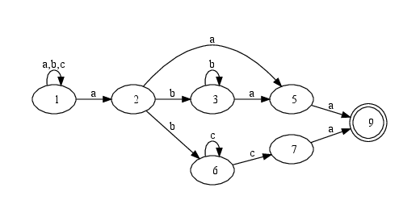

  The non-deterministic automaton corresponding to the expression
  “``.*a(b*a|bc+)a``”, after removing ε-edges

Thus we have outlined the approach to testing whether a string matches 
a regular expression using finite automata. Finding match positions
and capturing groups is more difficult, and we direct the reader to
`Russ Cox' article <http://swtch.com/~rsc/regexp/regexp3.html>`_ for a more thourough treatment — we do not present
the traditional approach here ourselves, because we shall use a 
different one.

Approach to incremental matching
--------------------------------

Now let us gradually arrive to the basic ideas of incremental matching.

First, let us depict this automaton in a slightly different way.

Every possible input character has a
“transition function”: “What will be the next states of the automaton
after feeding this character to the input, if its current state is
:math:`S`?” It can also be seen that the notion of such a “transition
function” makes sense not only for individual characters, but for whole
strings. **Strings have transition functions, too!**

Given a string's transition function, however long this
string might be, we can emulate feeding it to the automaton's input
without even looking at its characters. A string's transition
function is computed from the transition functions of its
characters (which is also shown on the picture below);
in the same way, given transition functions for two strings, we
can compute the transition function of their concatenation.

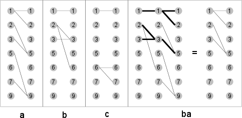

  Transition functions of a non-deterministic automaton and their composition

Note that the transition function of a concatenation of two strings
is the composition of their transition functions, in a slighty unusual
sense. 

If we were speaking of deterministic automata, then transition
functions would be regular mathematical functions from :math:`S` to :math:`S`,
where :math:`S` is the automaton's set of states.

Given two strings :math:`p` and :math:`q` with corresponding transition
functions :math:`f` and :math:`g`, feeding :math:`pq` to the automaton
will take :math:`s` to :math:`f(s)` and then to :math:`g(f(s))`,
which means that the transition function of :math:`pq` is :math:`g \circ f`.

However, we're using NFAs, and transition
functions of characters and strings take states to *sets* of states.
Note that we do *not* say that the *inputs* of these
functions are also sets of states: it suffices to define them
only at individual “singleton” states: applying a transition function
to a set of states means applying it to each of these states individually
and taking a union of the results (imagine that a simulation of the 
automaton occurs simultaneously for all these states).

So suppose again that the transition functions of :math:`p` and :math:`q`
are :math:`f` and :math:`g`. Then if the automaton's initial state is 
:math:`s` (some individual state), then :math:`pq` will take the automaton
first to :math:`f(s)` (a set of states) and then to :math:`\bigcup_{r \leftarrow f(s)}{g(r)}`.

This is the definition of
composition for transition functions of non-deterministic automata:
:math:`(f \circ g)(s) = \bigcup_{r \leftarrow f(s)}{g(r)}`.

This definition is curious because it has several interpretations.
  
* The interpretation given just now;

* The graphical interpretation as connectivity in a two-layer graph,
  as on the picture above;

* Multiplication of boolean matrices: if we represent the transition
  function :math:`f` as an :math:`N x N` boolean matrix (where :math:`N`
  is the number of states in the automaton) with :math:`1` in cell 
  :math:`s,t` if :math:`t \in f(s)`.

  Then we may rephrase the definition 
  :math:`(f \circ g)(s) = \bigcup_{r \leftarrow f(s)}{g(r)}` as follows:
  :math:`(f \circ g)(s,t) = \bigvee_{r \leftarrow f(s)}{t \in g(r)} = \bigvee_{r \leftarrow 1..N}{(s,r) \in f \wedge (r,t) \in g}` .

  Note the extreme similarity with matrix multiplication:
  :math:`(AB)[i,j] = \sum_{k \leftarrow 1..N}{A[i,k]*B[k,j]}`: only summation
  is replaced with logical “or” (:math:`\vee`) and multiplication
  is replaced with logical “and” (:math:`\wedge`).
  
  This interpretation is of course not new; it is a well-known fact shown
  in most textbooks on graph theory that connectivity in graphs may 
  be computed using multiplication of boolean matrices corresponding 
  to their incidence matrices. However, it opens some opportunities
  for optimization by employing well-known algorithms for fast matrix 
  multiplication.
    
Making use of transition functions
^^^^^^^^^^^^^^^^^^^^^^^^^^^^^^^^^^

Let us now consider how this knowledge of transition function multiplication
helps us implement incremental matching.

We shall start with a simpler problem: **match testing**, i.e. answering the 
question “Does the string :math:`s` match regular expression :math:`R`?”

This is by definition equivalent to the question “Does the transition function
of :math:`s` take :math:`R`'s automaton to a final state?”. So, if we
maintain transition functions of strings under the incremental operations
(concatenations and splits), we'll be able to also maintain the answer
to this question.

**Handling concatenations is simple**: given that we've learnt to rapidly 
compute transition functions of string concatenations, we've essentially 
learnt to rapidly recompute results of “yes/no”-style match tests 
after concatenations. 

Therefore, if we carry with each string its transition function 
(a device for rapidly performing a match test), then when concatenating 
two strings, we'd compose their functions, yielding again a device 
for rapidly testing their concatenation for a match. 

Reducing splits to concatenation
^^^^^^^^^^^^^^^^^^^^^^^^^^^^^^^^

**Handling splits is harder**: it is not obvious how to get the transition
function of a part of a string, knowing only that of the whole string.

However, this problem of splitting is, curiously, *reduced to the problem 
of concatenation*: if we represent a string as an hierarchical concatenation 
(a tree) of several smaller parts (chunks), then parts of this string will be 
concatenations of some of these chunks. More precisely, a part of the string
equals the concatenation of all complete subtrees fully
enclosed within that part, with incomplete chunks giving birth to new tiny
but complete subtrees — see picture below.

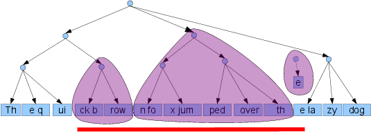

  Representing a part of a string as the concatenation of its smaller parts

If a split goes through the middle of a chunk, we'll still have to 
recompute the transition function for the resulting “sub-chunks” 
character by character, but most of the chunks or bigger parts of
the hierarchy will remain intact and **we won't have to recompute
their transition functions**, thus saving most of the computation.

All that remains is to choose a good way of representing a string
as many chunks, so that concatenation and splitting are efficient,
and memory overhead is not too high. This is what we consider in the
next section.

Note again that **this still does not allow finding positions of matches** — 
only whether the string matches the expression or not. This is perhaps
the most interesting algorithmic problem in this article, and we shall
address it later when more background is given.

Putting it together
-------------------

Now, before going to the technical and most interesting parts, let us
recap on the basic idea of incremental matching.

* We represent strings as trees of chunks (small “atomic” strings).

* With each string (actually with each node in a tree representing
  a string) we carry its transition function with respect
  to the regular expression of interest.

* To perform a match test, we simply take the transition function,
  apply it to the automaton's initial state and check whether
  we hit a final state. We don't even look at the string per se.

* When concatenating two strings, we multiply their transition functions.

* When splitting a string into parts, we reduce that to concatenation
  of some of its nodes — remember that we keep the transition
  functions for all the nodes.

An example of such a datastructure is illustrated on the picture below.

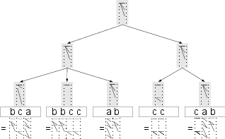
  
  Example representation with cached transition functions for the string :math:`bcabbccabcccab`

Ropes: Strings with fast concatenation
^^^^^^^^^^^^^^^^^^^^^^^^^^^^^^^^^^^^^^

This data structure, which is a tree of small arrays, is called a “rope”,
and ropes are frequently used for representing strings where efficient
concatenation and splitting are needed while preserving reasonably
low memory overhead (e.g. having a balanced tree of individual 
*characters* is not an option because it blows up memory usage). 

Ropes are a long-known datastructure and there are many varieties of them,
usually differing in the kind of balanced trees they use. One of these
varieties is described in the article `Ropes: An alternative to 
strings <http://dx.doi.org/10.1002/spe.4380251203>`_ by Hans-J. Boehm, Russ Atkinson, and Michael Plass, 
but we'll use a different one, to be shown later in the article.

Maintaining the transition functions of rope nodes at concatenations
and splits is simple for every variety of ropes: exactly as we assemble 
new nodes from old nodes during rebalancing, we assemble the transition 
functions of new nodes from transition functions of old nodes (by 
composing them). 

Even the definition of rebalancing operations doesn't have to be modified,
just the constructor for composite nodes (nodes with children) has to
multiply the children's transition functions to obtain one for the parent,
and the constructor for chunks has to assemble the transition function
from transition functions of characters.

Generalizing ropes
^^^^^^^^^^^^^^^^^^

Note that there is not much special about transition functions that
allows us to maintain them under splits and concatenations. The only
reason why we could do so is because we can compute the transition
function for a concatenation of two strings from their transition 
functions.

So, essentially ropes allow us to maintain absolutely
any kind of “additive” characteristic (and we're of course not 
restricted to speaking about strings, i.e. lists of characters — for 
example, lists of numbers are just as fine). There is just one
restriction: in order for the additivity to make any sense, it must
not be dependent on the order in which we add up the items to obtain
the whole; this property is called **associativity**:
since for concatenation holds :math:`a(bc) = (ab)c`, 
the additive characteristic :math:`f` must obey :math:`f(a(bc)) = f((ab)c)`,
that is, if the additivity is expressed as :math:`f(ab) = g(f(a), f(b))`,
then :math:`g` must obey :math:`g(g(x,y),z) = g(x,g(y,z))`.

Here are some examples of additive (associative) characteristics:

* The sum of a list of numbers

* The maximum and minimum number

* The sum of squares of a list of numbers

* The sum and size of a list of numbers (allowing to maintain the average, e.g. for answering “range average” queries)

* The number of times a given character occurs in the string
  (for example, the newline character)

There are many more examples, you can find them near the end of the
article, in the section “Monoids”.

Below is an example of a rope of numbers maintaining the minimum 
and maximum — the combining operation here is
:math:`g((m_1,M_1), (m_2,M_2)) = (min(m_1,m_2), max(M_1,M_2))`

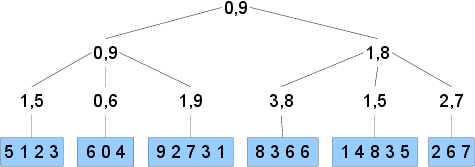

  A rope of numbers with “cached” minimums and maximums.

Monotone split operation
^^^^^^^^^^^^^^^^^^^^^^^^

In addition to splitting at a position, one may implement one more
very important and beautiful operation on ropes: splitting on a monotone
predicate. We shall need this operation when we get from “testing 
for a match” to “locating matches”, but we first provide an abstract
setting, because it will be a lot easier to understand how locating matches
can be done using this abstract algorithm, than to 
go in the opposite direction (recognize its beauty inside the full
complicated algorithm for locating matches).

Suppose :math:`f` is a predicate on strings. Suppose that :math:`f` is
such that a string may only *gain* (but not lose) the property
:math:`f` when symbols are appended to it on the right, i.e.,
:math:`\forall s_1, f(s_1) \Rightarrow \forall s_2, f(s_1 + s_2)`.
In this case let us call :math:`f` **monotone**.

Then obviously each string :math:`s` satisfying the property :math:`f` 
has a *minimal prefix* satisfying :math:`f`. Let us illustrate 
this notion and the algorithm for its efficient computation on a rope:

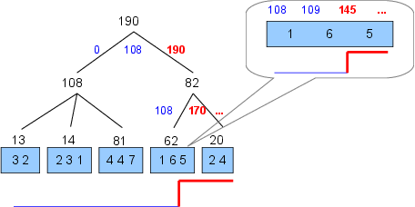

  Splitting a rope of numbers by the monotone predicate “Sum of squares exceeds 140”

This picture shows a rope of numbers,
storing in each node the sum of squares of numbers within this node,
and it also shows how the rope is split to find *the minimal prefix whose
sum of squares is greater than 140*. The algorithm resembles **a “hot and cold” 
game**; the figure shows sums of squares of prefixes before and after 
various edges and (when scanning a leaf chunk) individual numbers;
those that do not yet satisfy the condition are marked with “cold” blue color,
and those that do are marked with “hot” red. This picture also shows that when
scanning through a leaf chunk, we have to recompute and add up the squares of numbers,
i.e. the information stored in nodes of the rope is not sufficient.

On this picture **an edge is marked red if the predicate is true for the 
prefix which ends where this edge ends**. To find the split point,
we have to descend from the root of the rope to a leaf chunk, doing steps 
downward or to the right, at each level scanning edges left-to-right
until we find a red edge (this is similar to a binary search procedure),
and finally split the leaf chunk, this time using regular linear search.

Since we only move downward or to the right, at any moment the edges that
have been considered cover together an ever-growing prefix of the original
rope, and **each new scanned edge appends the rope covered by this edge**
to this prefix. If the predicate is not true before scanning an edge but
becomes true after scanning it, this means that it becomes true somewhere
inside the part of the rope covered by the destination node of this edge,
and we have to descend downward into this node in order to find the split
point.

In order to be constantly aware of whether the predicate is true, we should
be able to **quickly compute** :math:`f(ps)`, **given** :math:`f(p)` **and** :math:`f(s)`
for any two ropes :math:`p` and :math:`s`, since when moving downward or
to the right, we increase the “current prefix” (:math:`p`) with sub-ropes
covered with each scanned edge (:math:`s`), and when we get to the leaf chunks,
during linear search we increase :math:`p` with single-element sub-ropes
corresponding to elements of the chunk. 

Now note that match testing also sometimes fits this pattern: 

* Given transition functions for :math:`p` and :math:`s`, we can quickly 
  compute the transition function of :math:`ps`, and given that transition 
  function, we know the answer to the match test. 

* **Some regular expressions are monotone**, i.e. if a string matches the
  expression, then appending characters on the right won't make it lose
  this property. One class of such regular expressions is expressions
  of the form ``.*R.*`` for any ``R``, because they correspond to
  the question “Is there a match of ``R`` somewhere in the string?”,
  which obviously is monotone.
    
So, we can use this “monotone split” procedure to find the **smallest prefix 
of the string containing a match** of our regex.

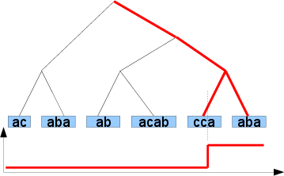
  
  Splitting a rope for the string ``acabaabacabccaaba`` on the monotone predicate “matches ``.*bcc.*`` ”

This is key to finding match positions.

Finding match positions
^^^^^^^^^^^^^^^^^^^^^^^

Suppose we have to find a match of :math:`R` in the string. This problem can 
partly be reformulated as testing the string against the expression
“:math:`.*R.*`”, but this only tells us the answer to the question 
“is there a match of :math:`R` somewhere in the string?”, but not to 
“where is the match?”

Two key ideas will help us find the match positions.

* As said above, the answer to the first question (the presence of a
  match) is “monotone”. That is, starting from some
  prefix of the string, the answer will be positive for all
  subsequent prefixes. **The first occurence of** :math:`R*` **ends
  exactly where the first such prefix ends**.

* It is known [#f4]_  that, given a regular
  expression :math:`R` or its corresponding automaton :math:`A`, one
  can build a regular expression :math:`R′` and the automaton
  :math:`A′` which recognize reverses of the strings recognized by
  :math:`R` and :math:`A`, simply by reversing all sequences inside
  :math:`R` and, correspondingly, all arrows in :math:`A`. For
  example, the expression :math:`a+(b|c*d)x*` recognizes the string
  :math:`abbdxx`, and the expression :math:`x*(b|dc*)a+`
  recognizes :math:`xxdbba`. Therefore, **we can find the
  beginning of the match by launching the reversed
  (“backward”) automaton** (automaton for the reversed expression)
  backward over the string, starting from where the match
  ends.

So, we use the “split on monotone predicate” operation to find the
end of the first match, and use it again, but this time in backward
direction and with the backward automaton, to find its beginning. If
the expression is such that strings matching it are usually small, we
can just run the backward automaton character by character; if not, we
can also have the nodes of the rope store transition functions 
not only for the “forward” automaton, but also transition functions of
reversed parts of the string with respect to the “backward” automaton.

It's easy to see that all rope operations change trivially — instead 
of composing one pair of transition functions, we compose two:
:math:`(f_1,b_1) \circ (f_2,b_2) = (f_2 \circ f_1, b_1 \circ b_2)` — 
note that the order of composition for backward transition functions
is reversed because for strings if :math:`a=bc`, then 
:math:`reverse(a)=reverse(c)reverse(b)`.

There is actually a number of complications here, related to possible
overlaps of occurences of different items from the given system of
regular expressions (or even self-overlaps), but the main idea is the
same: split to find the end of the match, split backward to find the
beginning. The curious reader is directed
`to the source code <https://github.com/jkff/ire/blob/master/src/main/java/org/jkff/ire/DFAMatcher.java>`_.

Implementation
--------------

Let us put together the presented algorithms and overview the
structure of the whole program. Graphically this structure is shown on
the pictures below. This kind of diagrams is called “concept maps”,
drawn with `IHMC CmapTools <http://cmap.ihmc.us/>`_ software.

Program structure overview
^^^^^^^^^^^^^^^^^^^^^^^^^^

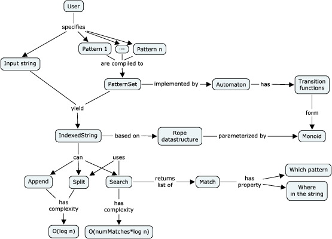
  
  Program structure overview

The user specifies several regular expressions as strings, which through
compilation (parsing and converting to a finite automaton) get
transformed to an object of type `PatternSet <https://github.com/jkff/ire/blob/master/src/main/java/org/jkff/ire/PatternSet.java>`_.
Such an object
is capable of “indexing” regular strings, yielding objects of type
`IndexedString <https://github.com/jkff/ire/blob/master/src/main/java/org/jkff/ire/IndexedString.java>`_.
They, in turn, are capable of efficiently
searching for all matches of the patterns in themselves, and they can
also efficiently be concatenated or split (on a monotone predicate).
These are of course the very ropes maintaining transition functions.

Ropes and additive measures
^^^^^^^^^^^^^^^^^^^^^^^^^^^

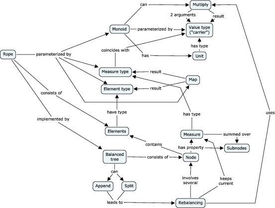
  
  Program structure: ropes and additive measures

“Indexed strings” are implemented with ropes (`Rope <https://github.com/jkff/ire/blob/master/src/main/java/org/jkff/ire/rope/Rope.java>`_).
The program
implements only ropes over characters, because further generalization
was not necessary within the scope of our problem and the Java type
system would cause the generic implementation to have a lot of
syntactic garbage. A rope is a string that knows its “measure” of
type ``M``. The measure is computed as the sum of measures of
individual characters (``Function<Character,M>``) under an arbitrary
additive measure (`Reducer <https://github.com/jkff/ire/blob/master/src/main/java/org/jkff/ire/util/Reducer.java>`_).
Ropes are implemented with a special kind
of balanced trees that will be described later in the article. During
rebalancing operations measures of new nodes are summed from measures
of old nodes using this additive operation.
For regular expression matching, the
additive operation composition of transition functions 
for the expression's automaton (more precisely, for two automata: 
forward and reverse).

Finite automata
^^^^^^^^^^^^^^^

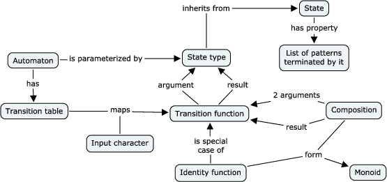
  
  Program structure: finite automata

Automata are implemented in a way that facilitates representing and computing
their “transition functions”. An automaton can tell its
transition function for any given character, and the transition
function is a function from the automaton's state type to the same
type. A value of the state type is a “black box” that only tells
what patterns are “terminated” by this state: if after scanning a
string, the automaton's state terminates certain patterns, then there
are occurences of these patterns ending at the end of this string.
Transition functions are represented not as arbitrary functions but as
a special kind of objects with efficient composition [#f5]_.
These objects are placed into the ropes used as “indexed
strings”.

Relationship between DFAs and NFAs
^^^^^^^^^^^^^^^^^^^^^^^^^^^^^^^^^^

.. figure:: images/ire-dfa-nfa.png
  :align: center
  
  Program structure: the connection between deterministic and non-deterministic automata

The notion of an automaton is used
in the program in two ways: for deterministic and non-deterministic
automata. The state type of a deterministic automaton [#f6]_ is the set of
integer numbers from :math:`0` to some :math:`N`; correspondingly,
transition functions are functions from :math:`0 … N` to :math:`0 … N`.
They are implemented as one-dimensional ``int[]`` arrays, and
their composition is computed as easily as ``c[i] = b[a[i]]``.

In the case of
non-deterministic automata, values of the state type are subsets of
some “basis” state set, and a transition function is determined by the
way in which is transforms each individual basis state to several
other basis state, i.e. it is specified by a transformation of them
form ``int`` → ``int[]``. Composition of such functions is expressed as
:math:`c[i] = \bigcup_{j \leftarrow a[i]} b[j]` (thread the second function
through all the outputs of the first function). For the sake of efficiency, this
transformation is implemented by a boolean matrix with every element
represented as one bit in a single array [#f7]_.

Multiple regular expressions
^^^^^^^^^^^^^^^^^^^^^^^^^^^^

The aforementioned datastructure allows to match a string against a single 
regular expression. It is natural to demand a more practically useful 
generalization: matching against multiple expressions (there exist also 
other approaches to this problem, see for example the article
“Compact DFA structure for multiple regular expressions matching” by
Lin, Tang et al.).
The result of such a match is a set of facts of the form “The portion 
:math:`i..j` matched expression :math:`k` ”.

The problem of matching against multiple regular expressions
is solved quite easily: we build an automaton for their union,
:math:`R_1|R_2|...`, but we distinguish between final states
for different expressions, i.e. a state of the resulting automaton
is not simply “final” or “non-final”, but it has an associated bitset:
for which of the expressions it is final.

This change only slightly influences other parts of the program, such as 
automata minimization or finding match positions.

Examples and benchmarks
-----------------------

Let us show an example of usage of the library.::

   PatternSet pat = RegexCompiler.compile("007","008")
   IndexedString s1 = pat.match("as00haklsdjhfla00");
   IndexedString s2 = pat.match("7jhd7dsh008dsfa");
   System.out.println(s1.append(s2).getMatches());

The program prints::

   [0@(15,3), 1@(25,3)]

This means that occurences of the first and second pattern were found
correspondingly in positions 15–17 and 25–27.

This code uses the following aspects of the API:

* `RegexCompiler.compile <https://github.com/jkff/ire/blob/master/src/main/java/org/jkff/ire/regex/RegexCompiler.java>`_ — compile several regular
  expressions to an automaton recognizing any of them.

* `PatternSet.match <https://github.com/jkff/ire/blob/master/src/main/java/org/jkff/ire/PatternSet.java>`_ — index a “regular” string, preparing
  it to searching for the given patterns.

* `IndexedString.append <https://github.com/jkff/ire/blob/master/src/main/java/org/jkff/ire/IndexedString.java>`_ — compute the concatenation of two
  strings indexed by the same pattern set.

* `IndexedString.getMatches <https://github.com/jkff/ire/blob/master/src/main/java/org/jkff/ire/IndexedString.java>`_ — find matches of the pattern
  set in an indexed string.

Now let us discuss the library's performance.

This discussion won't be a simple one, because the performance is
influenced by a large number of factors.

* **Size of the automaton**, which depends approximately linearly on
  the number and size of individual regular expressions: it linearly
  influences both the performance of all operations and the memory
  consumption (larger is worse). The program uses an algorithm for
  minimization of non-deterministic automata described in
  the article “On NFA reductions” by Ilie and Navarro.
  (however, the implementation is extremely
  inefficient, but this doesn't influence matching performance
  because minimization is only done in `RegexCompiler.compile <https://github.com/jkff/ire/blob/master/src/main/java/org/jkff/ire/regex/RegexCompiler.java>`_),
  but it usually shrinks the
  automaton just by several dozen percent.

* **Size of the leaf chunks** in ropes linearly influences search
  performance (larger is slower), has almost no influence at all on
  concatenation performance, and linearly influences memory
  consumption (the larger the chunks, the fewer the memory
  overhead).

* **Features of the particular regular expression** influence the
  automaton's “shape”, which in turn influences the speed of
  operations on it (“hairy” expressions lead to dense boolean
  matrices for transition functions, which are slower to multiply in
  the current implementation).

* **Number of matches** linearly influences the search time in the
  current implementation (larger is worse), but there is room for
  optimization here.

It is also necessary to balance the share of time devoted to indexing
the string, doing concatenations/splits and searching. Indexing is
done quite slowly, and one needs a large number of
concatenations/splits and search to overweight it and to get an
advantage over a “traditional” regular expression engine.

Test setup
^^^^^^^^^^

In light of the above, let us consider just a single test and analyze
its performance. Take the set of regular expressions from the
`regex-dna <http://shootout.alioth.debian.org/u32q/performance.php?test=regexdna>`_
problem from the Language Shooutout
and consider performance of matching operations compared to the
standard regular expression engine bundled with Java
(`java.util.regex.Pattern <http://download.oracle.com/javase/1.5.0/docs/api/java/util/regex/Pattern.html>`_), varying length
of the input DNA string (but keeping constant the total number of
matches) and size of the leaf chunks: 8, 16, 32, … 512
characters.

We do not measure splitting performance
separately, because splitting is used during search, and we do not 
measure concatenation performance because
it is so fast (allocate a few objects and compose a few transition functions)
that it is difficult to imagine a scenario where it would be the
bottleneck.

Here is the pattern set::

   [cgt]gggtaaa|tttaccc[acg]
   a[act]ggtaaa|tttacc[agt]t
   ag[act]gtaaa|tttac[agt]ct
   agg[act]taaa|ttta[agt]cct
   aggg[acg]aaa|ttt[cgt]ccct
   agggt[cgt]aa|tt[acg]accct
   agggta[cgt]a|t[acg]taccct
   agggtaa[cgt]|[acg]ttaccct

Let us generate the input as a random sequence of the characters
“``a``,``g``,``c``,``t``” of length :math:`50000 N`
(:math:`N` will vary from 1 to 10) where any two consequent characters
are distinct (therefore the aforementioned patterns can't occur
there), choose 100 random positions in the sequence and insert there
occurences of strings randomly chosen from the set of :math:`8 × 2 × 3 = 48`
strings defined by the given pattern set. The program will
compute the occurence count of each pattern.

Benchmark results and interpretation
^^^^^^^^^^^^^^^^^^^^^^^^^^^^^^^^^^^^

Results of the benchmark are shown on the pictures below. The
performance characteristics of each of the two programs (our engine
and the standard Java engine) are shown in the terms that are most
appropriate for them: for our engine it is the indexing speed (in
characters per second, because indexing speed is proportional to the
number of characters) and search speed (in occurences per second,
because search speed is proportional to the number of occurences). For
the Java engine a more appropriate characteristic is “characters
processed per second”; it is displayed on the same graph with our
engine's “indexing speed', though this comparison is somewhat
flawed.

On graphs in the left part of the picture, different curves correspond
to different *base sizes of chunks* in the rope datastructure,
and the bold curve corresponds to the Java engine.

**The question “When is our engine better than the Java engine?” is
best answered by the top left graph**, which shows the dependence of
search speed on the string length. It can be seen that the Java
engine's search time is proportional to the length of the string, and
our engine's time is proportional to the number of occurences. With
small base chunk sizes (4–32 characters) our engine is much faster
for large strings.

On graphs in the right part of the picture, different curves
correspond to different *lengths* of the input string. They are
displayed to show how the base chunk size influences search and
indexing speed. It can be seen that with increase of this chunk size
indexing speed increases rapidly (but with a limit) and search speed
decreases just as rapidly.

We can conclude that **for large strings with a small number of
occurences our engine is more efficient**, especially if tuned for a
small base chunk size. However, in this case there is a sharp increase
in memory consumption: memory consumption per leaf chunk does not depend
on the chunk size, but there are 128 times more of 4-character chunks
in a string then there are 512-character chunks, therefore the memory
consumption is also 128 times larger.

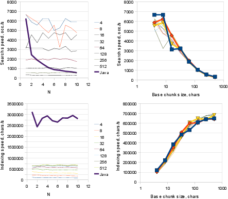
  
  Performance benchmarks

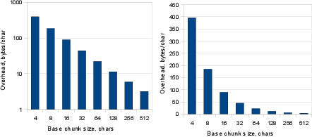
  
  Memory overhead

**Almost all the time is spent composing transition functions of characters**
(which is done through boolean matrix multiplication) for recomputing 
transition functions of leaf chunks during
splits, and almost all the memory overhead is devoted to storing these
boolean matrices.

We haven't considered the dependence of performance on the complexity
of regular expressions and on the number of occurences. A
comprehensive treatment of performance questions would take up too
much space; curious readers are encouraged to play with the library
themselves.

What's next?
------------

The current implementation has a number of drawbacks. It is not yet
clear which of these can be fixed and which can't, but in any case, they are
interesting algorithmic problems worth thinking about.

* The questions of match semantics, such as “greediness” etc. are
  not considered in the program at all. It is unclear which of the
  popular solutions (POSIX, Perl, …) are efficiently
  implementable within the automata-theoretic approach.

* Capturing groups are not supported. The article
  `Regular Expression Matching in the Wild <http://swtch.com/~rsc/regexp/regexp3.html>`_
  describes a way to
  support them with automata, but the proposed solution does not fit
  well with our approach.

* Multiplication of boolean matrices (used for computing the
  composition of transition functions) uses a well-optimized but
  rather naive algorithm; perhaps in some scenarios other algorithms
  would be faster (for example, ones using sparse matrices).

* During matching using splits, a lot of unneeded work is done: for
  example, during the backward split (which is used to find the
  *beginning* of a match) there's no need to compute the
  transition function
  for the two resulting strings. Fixing this problem would increase
  performance by a couple dozen percent.

* Matching time is proportional to the number of occurences, the
  leaf chunk size and the automaton's size. This makes the program
  nearly useless as an efficient incremental lexer, because in
  lexing problems the number of occurences is very large. One of the
  ways to fix this problem is to modify the “split by monotone
  predicate” algorithm to split not into two, but into many parts,
  for example, on the “edges” of a monotone integer-valued
  function.

Conclusion
----------

So, we've built a library that does incremental matching of strings
against a set of regular expressions using balanced trees and monoids.
The library is very efficient in the case of long strings, few
expressions, few occurences, frequent incremental recomputation and a
lot of free memory, and is quite inefficient in other cases. It's hard
to say, for which of the cases it is at all possible to make it
efficient: for example, whether it is possible to create a
high-performance incremental lexer with it, and whether we can at all
name this experiment an algorithmic success. The author hopes at least
that the presented techniques will inspire the algorithmically
inclined readers for new research and will prove of use to them in
other problems.

In any case, we can say that this development is an interesting and
successful experience of blending the functional and imperative
approaches.

Let us list the used techniques, ideas and traditions from functional
programming, and discuss how well they fit with the imperative nature
of the target language (Java).

* The main datastructure, the rope, is pure (immutable). This
  decision fit very well with the Java language and dramatically
  simplified development and debugging, despite the absense of
  language features such as algebraic datatypes and pattern
  matching.

* Nearly all of the library's API is pure (doesn't have side
  effects). However, mutable state and side effects are abandoned
  only on an architectural level, but the implementation has quite a
  few usages of mutable state, both for the sake of performance
  (multiplication of boolean matrices) and, paradoxically,
  readability (building an antomaton from a regular expression). See
  the source code for, correspondingly, ``PowerIntTable`` and
  ``RegexCompiler`` for details. All in all, this means that the
  purely functional approach to programming fits well with
  imperative languages and doesn't prevent us from using mutable
  state in the cases where it brings more use than harm.

* Contrary to the common myth “functional programming is inefficient
  and leads to excessive memory consumption”, the only performance
  bottleneck is in the imperative algorithm of transition function
  multiplication, and memory is used for storing these transition
  functions for rope nodes as bitmasks. Apparently there is no
  connection between the overheads and the pure nature of the
  algorithms [#f8]_.

* The core of the program is manipulation of higher-order functions:
  ropes are parameterized by monoids, and their most important
  operation, splitting, is parameterized by a predicate. Since Java
  does not have a compact syntax for function definition (such as
  lambda expressions) and type inference, usage of these entities
  causes quite a lot of syntactic garbage (especially types in
  declarations). However, though their usage is extremely important
  for the program as a whole, it is concentrated in a rather small
  region of the code, isolated from the library's end users.
  However, if the Java type system were a bit more powerful and a bit
  less verbose, it would be possible to generalize the library,
  without loss of performance, to searching not just strings but
  arbitrary sequences.

The author would like to thank Dmitry Demeschchuk, Julia Astakhova,
Alexey Ott and other reviewers of the original Russian version
of this article for their feedback.

The project is published on GitHub at http://github.com/jkff/ire.

Appendix 1: Implementation of ropes
-----------------------------------

It has already been said that, when representing a string by a
balanced tree, in order to keep memory usage reasonable, one should
associate each leaf of the tree not with one character but with a
chunk. Therefore, the datastructure suggested in
`Dan's post <http://blog.sigfpe.com/2009/01/fast-incremental-regular-expression.html>`_ (finger
trees, described, for example, `by Heinrich Apfelmus <http://apfelmus.nfshost.com/monoid-fingertree.html>`_
and in the `original paper <http://www.soi.city.ac.uk/~ross/papers/FingerTree.html>`_)
is not a good fit: it assumes one node
per each element of the sequence (string).

We should choose one of the kinds of balanced trees satisfying our
requirements. Let us list the requirements.

* It should be possible for the nodes to store the sum of their
  subtree with respect to an arbitrary additive measure;

* It should be cheap to update this sum during rebalancing
  operations (and there should be few of them);

* The tree's height should be logarithmic in the number of elements;

* Concatenation and splitting operations should be efficient.

One of the simplest (in terms of implementation) but nevertheless
quite efficient balanced trees are **trees of constant height**, for
example “2–3-trees” and “B-trees” (which are
frequently used for DBMS indices).

In such trees, the length of the path
from root to each leaf is the same, therefore (since each non-leaf
node has at least 2 children) the height is logarithmic. Usually they
are used for a quite different class of problems, namely that of
representing sets and searching them, but they are also a perfect fit
for representing sequences (strings). The basic idea is that a node is
allowed to have :math:`K` to :math:`2K-1` children (for some :math:`K`)
and most operations, such as insertion, splitting and concatenation,
preserve this property; and when they don't, a rebalancing occurs:
either an overflown node is split into two, or two underflown nodes
are merged into one.

We shall use a variation on this theme: 2–3 trees with chunks in
leaves, where the chunk size may vary from :math:`N` to :math:`2N-1`,
and all data is stored in leaves, not in nodes [#f9]_.

The next picture illustrates the implementations of all
operations on such trees. Essentially two operations suffice:
splitting and concatenation, all others can be expressed through them.
When digesting the pictures, it is important to remember that we're
dealing with trees of constant height. Note also that the chunk size
invariant may be broken, but only in the case where there are less
than :math:`N` elements total: in this case the tree is represented by
a single underflown chunk.

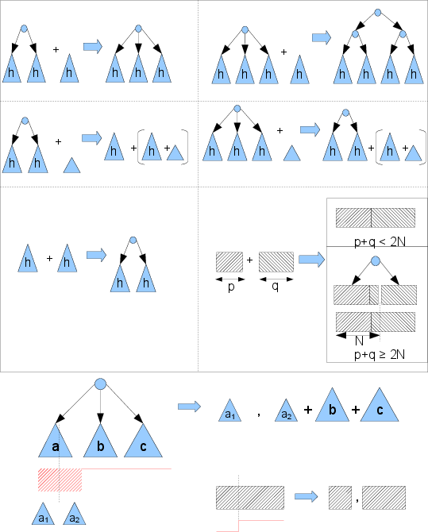
  
  Rope operations

Let us explain these pictures briefly in the order in which they appear,
top to bottom, left to right:

* Concatenating a rope of height :math:`h+1` and a rope of heigh :math:`h`
  has two cases: when the first one is a 2-node and a 3-node respectively.

* Concatenating a 2-node of height :math:`h+1`, which is a 2-node with children 
  of height :math:`h` and another rope of height :math:`h` simply makes
  a 3-node.

* Concatenating a 3-node of height :math:`h+1` with a node of height :math:`h`
  is the only case where a rope's height increases: we put those 4 
  :math:`h`-high nodes into a 2-node of 2-nodes.

* Concatenating a rope (2-node or 3-node) of height :math:`h+1` and a rope with 
  height smaller than :math:`h` is reduced, through the associativity of 
  concatenation, to recursively concatenating the last :math:`h`-node of the first
  rope with the second rope, and concatenating the remainded of the first rope
  with the result.

* Concatenating two ropes of equal height is the simplest case: they make a 2-node.

* Concatenating two chunks is the only slightly non-trivial case: if their 
  total size is smaller than the maximum chunk size (i.e. :math:`2N`), then
  we simply concatenate the arrays and form a new chunk. If it's bigger than 
  :math:`2N-1` (though it can't be bigger than :math:`4N-2`), then half of this 
  number is between :math:`N` and :math:`2N-1`, which allows us to perfectly
  make a 2-node of halves of their concatenation.

* Splitting a 2-node or 3-node is done by summing its 2 or 3 children until the 
  predicate of the sum becomes true, and then descending into the child that
  caused this, because the split point must be somewhere inside it. Then we
  assemble the splitting result of the original node from its other children
  and parts of the split child. An example is drawn for the case where already
  the sum of the first child satisfies the predicate.

* Splitting chunks is done in a most straightforward linear fashion.

One of the most important aspects of this datastructure is its
“purity”: operations on it do not change an existing instance but form
a new one instead, i.e. they are functions in the mathematical sense.

We have already mentioned the importance of the decision to make the
incremental interface “pure”, but now it is time to elaborate. 

The importance of purity
^^^^^^^^^^^^^^^^^^^^^^^^

There are many advantages to using a pure approach to algorithms
and datastructures, which have manifested themselves during the
implementation of this program, particularly in the implementation
of ropes.

**Exceptional ease of implementation.** Essentially we can take
the diagrams drawn on the picture above and translate them
mechanically to code. Lack of mutability causes the code to be a lot
simpler, and its correctness (or lack thereof) becomes more obvious,
because the code doesn't have the *time* dimension anymore, and
in order to understand how it works, one does not need to mentally
trace a sequence of intermediate steps [#f10]_: the code is just an enumeration of various cases
where for each branch it is declared that “such and such input yields
such and such output”. And indeed, to the author's surprise, after
the first successful compilation only 1 or 2 silly mistakes were fixed
before the code passed all the tests.

**Ease of debugging.** During debugging one often wants to look
at the values of some expressions “in advance” in order to
understand whether it is necessary to step into them, or their result
is correct and the error is somewhere later in the
code [#f11]_ When these expressions are
“pure” (i.e., don't have side effects), such an approach is
possible. If side effects are present, then evaluating the expression
in the debugger will change the program's internal state and further
debugging will be pointless.

**Complete thread safety.** It is well known that most standard
mutable datastructures do not allow concurrent reading and
modification, and one must synchronize access to them in a
multi-threaded program. However, it is often desirable to provide
non-blocking read access, even if not the most current state of the
datastructure will be read. There exist tricks allowing to do that for
mutable datastructure (see, for example, the implementation of the
`ConcurrentHashMap <http://www.docjar.com/html/api/java/util/concurrent/ConcurrentHashMap.java.html>`_ or the
`ConcurrentSkipListMap <http://www.docjar.com/html/api/java/util/concurrent/ConcurrentSkipListMap.java.html>`_ classes in the
Java standard library), but for immutable datastructures no tricks
are necessary, because every instance can be safely read without
worrying about it being concurrently modified: it cannot be modified
at all.

**High performance and low memory consumption in certain
scenarios**. There exist situations where it is useful to preserve the
“original” version of a datastructure after applying an operation to
it (for example, to preserve access to two ropes after computing their
concatenation). Most importantly, these situations arise in
backtracking enumeration algorithms and genetic algorithms (for
example, when it is possible to combine two genomes in several ways,
when one wants to keep both the genomes and the result of their
crossover). Of course, one might just copy the original datastructure,
but that might be very inefficient, especially if the structure is
large. On the contrary, for pure datastructures there's no need to
copy, and we get a performance advantage. Also, as shown on the picture
above, many operations on ropes allocate miniscule (constant
or logarithmic) amounts of extra memory. The picture below
shows the object graph for two ropes and
their concatenation. It can be seen that most of the memory is used in
a shared fashion, but each object is nevertheless accessible
independently.

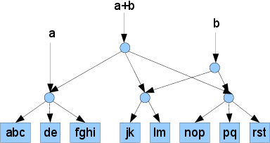
  
  Sharing of memory after rope concatenation.

To even better explain how rope concatenation and splitting work, and
why they are so easy to implement correctly, let us simply show the code.

.. code-block:: java
  :linenos:

  private static <M> Rope<M> append(Rope<M> left, Rope<M> right) {
      int blockSize = left.factory.getBlockSize();
      Reducer<M> reducer = left.factory.getReducer();

      M sum = reducer.compose(left.sum, right.sum);

      if (left.h == right.h) {
          // Case "Two non-leaves of equal height"
          if (left.h > 0)
              return new Rope<M>(left, right, sum);

          // Case "Two leaves, both large enough to be children of a 2-node"
          if (!left.isUnderflownBlock() && !right.isUnderflownBlock())
              return new Rope<M>(left, right, sum);

          // Case "Two leaf chunks, rebalancing needed"
          String bigBlock = left.block + right.block;
          if (bigBlock.length() <= 2 * blockSize - 1)
              return new Rope<M>(left.factory, bigBlock, sum);
          return new Rope<M>(
                  new Rope<M>(left.factory, bigBlock.substring(0, blockSize)),
                  new Rope<M>(left.factory, bigBlock.substring(blockSize, bigBlock.length())),
                  sum);
      } else if (left.h == right.h + 1) {
          if (left.c == null) // 2-node of h + h -> 3-node 
              return new Rope<M>(left.a, left.b, right, sum);
          else                // 3-node of h + h -> 2-node of 2-nodes
              return new Rope<M>(
                      new Rope<M>(left.a, left.b, reducer.compose(left.a.sum, left.b.sum)),
                      new Rope<M>(left.c, right, reducer.compose(left.c.sum, right.sum)),
                      sum);
      } else if (right.h == left.h + 1) {
          // Symmetrical
      } else if (left.h > right.h + 1) {
          // Break the larger tree into nodes, regroup using associativity
          if (left.c == null)
              return left.a.append(left.b.append(right));
          else
              return (left.a.append(left.b)).append(left.c.append(right));
      } else { // right.h > left.h + 1
          // Symmetrical
      }
  }

And then the splitting code, with a slightly curious interface.
This function splits a rope into two, given a monotone function on
the string represented by the rope. Monotonicity is exploited by
requiring to provide functions that compute :math:`f(a+b)` given
:math:`f(a)` and :math:`b`, where :math:`b` is either a string
(represented by a rope) or a single character (for finding the
rising edge within a leaf-level rope chunk).

.. code-block:: java
    :linenos:

    public <S> Pair<Rope<M>, Rope<M>> splitAfterRise(
            S seed,
            Function2<S, Rope<M>, S> addChunk, Function2<S, Character, S> addChar,
            Predicate<S> toBool) 
    {
        if (block != null) {
            // Simple linear search inside the chunk
            S s = seed;
            for (int i = 0; i < block.length(); ++i) {
                if (toBool.isTrueFor(s))
                    return Pair.of(
                            new Rope<M>(this.factory, block.substring(0, i)),
                            new Rope<M>(this.factory, block.substring(i, block.length())));
                s = addChar.applyTo(s, block.charAt(i));
            }
            if (toBool.isTrueFor(s))
                return Pair.of(this, new Rope<M>(this.factory, ""));
            return null;
        } else {
            // Start from seed
            if (toBool.isTrueFor(seed))
                return Pair.of(new Rope<M>(this.factory, ""), this);
            S afterA = addChunk.applyTo(seed, a);
            // If adding node A made the condition true, descend into A
            if (toBool.isTrueFor(afterA)) {
                // Split A and assemble result from b, c and parts of a
                Pair<Rope<M>, Rope<M>> sa = a.splitAfterRise(seed, addChunk, addChar, toBool);
                return (c == null)
                        ? Pair.of(sa.first, sa.second.append(b))
                        : Pair.of(sa.first, sa.second.append(b).append(c));
            }
            // Same for B
            S afterB = addChunk.applyTo(afterA, b);
            if (toBool.isTrueFor(afterB)) {
                Pair<Rope<M>, Rope<M>> sb = b.splitAfterRise(afterA, addChunk, addChar, toBool);
                return (c == null)
                        ? Pair.of(a.append(sb.first), sb.second)
                        : Pair.of(a.append(sb.first), sb.second.append(c));
            }
            // Same for C, if this is a 3-node
            if (c == null)
                return null;
            S afterC = addChunk.applyTo(afterB, c);
            if (toBool.isTrueFor(afterC)) {
                Pair<Rope<M>, Rope<M>> sc = c.splitAfterRise(afterB, addChunk, addChar, toBool);
                return Pair.of(a.append(b).append(sc.first), sc.second);
            }
            return null;
        }
    }
  

Addendum 2: Monoids
-------------------
Remember how, given a finite automaton, we can associate every string
with a “transition function” with respect to this automaton, and when
concatenating two strings their transition functions are composed (let
us denote the composition of :math:`f_1` and :math:`f_2` as
:math:`f_1 \circ f_2`.

Composition of transition functions (similarly to concatenation of
strings) has a few simple and useful properties:

* For any transition functions :math:`f`, :math:`g` and :math:`h`
  holds :math:`f \circ (g \circ h) = (f \circ g) \circ h`. This property
  of the “:math:`\circ` ” operator is called “associativity”.

* There exists a special transition function :math:`u` that maps
  every state of the automaton to the itself. It is called the
  “unit” of the “ :math:`\circ` ” operator because, just as
  :math:`1 ⋅ x = x ⋅ 1 = x` holds for the multiplication operator, for
  :math:`\circ` holds :math:`u \circ f = f \circ u = f`.

These two properties allow us to say that transition functions of a
finite automaton form a *monoid*.

More precisely, it is said that the set :math:`M`, the operation
:math:`⊗` and the element :math:`u ∈ M` (called the “unit” of this
operation) form a monoid} if the aforementioned two properties hold.

Since the notion of a monoid is so simple and general, it is
unsurprising that upon a close look at the “casual” objects in
programming one may see dozens of monoids. Some of them are listed in
the table below. Some applications of monoids to programming
are also listed in Dan Piponi's article `Monoids and their uses <http://blog.sigfpe.com/2009/01/haskell-monoids-and-their-uses.html>`_.

.. list-table:: Monoids
  :widths: 10 10 10 20
  :header-rows: 1

  * - The set :math:`M`
    - Operation ⊗
    - Unit :math:`u`
    - Comment

  * - Numbers
    - \+
    - 0
    - Natural, integer, real, complex, quaternions… 

  * - Numbers
    - ×
    - 1
    - 
  
  * - Integers
    - LCM
    - 1
    - 

  * - Polynomials
    - LCM
    - 1
    - 

  * - Numbers, strings…
    - MIN, MAX
    - Maximal and minimal element
    - 

  * - Booleans
    - AND
    - TRUE
    -

  * - Booleans
    - OR
    - FALSE
    -

  * - Matrices
    - \+
    - 0
    - Over numbers (+, ×), over numbers (+, MIN), over booleans (OR, AND), …

  * - Sets
    - Union
    - Empty set
    -

  * - Sets
    - Intersection
    - Complete set
    - Restricted to subsets of the “complete” set
 
  * - Lists, strings…
    - Concatenation
    - Empty sequence
    - 

  * - Dictionaries
    - Union
    - Empty dictionary
    - “Conflicts” are resolved in another monoid: :math:`(dic_1 ⊗ dic_2)[key] = dic_1[key] ⊕ dic_2[key]`

  * - Functions of type A → B
    - :math:`(f ⊗ g)(a)=f(a) ⊕ g(a)`
    - :math:`e(a) = e_B`
    - :math:`(B,⊕,e_B)` is a monoid

  * - Permutations
    - Multiplication
    - Identity permutation
    -

  * - Functions
    - Composition
    - Identity function
    -

  * - Tuples :math:`(x,y)` where :math:`x ∈ X, y ∈ Y`
    - :math:`(x_1, y_1) ⊗ (x_2, y_2) = (x_1 ⊕_X x_2, y_1 ⊕_Y y_2)`
    - :math:`(u_X, u_Y)`
    - If :math:`(X, ⊕_X, u_X)` and :math:`(Y, ⊕_Y, u_Y)` form monoids

  * - … 
    - … 
    - …
    -

.. [#f1] Dan Piponi is a specialist on computer graphics, having participated
    in the creation of all three “Matrices”, “Star Trek” and some other movies.

.. [#f2] There exist several algorithms for determinization, described,
  for example, in the article “An :math:`O(n log n)` algorithm for 
  minimizing the states in a finite automaton” by Hopcroft or see the 
  Brzozowski's algorithm. 

.. [#f3] For example, any deterministic automaton for an expression of the form
  ``(0|(01*)(01*)(01*)… 0)*`` will have size :math:`O(2^n)`, where
  :math:`n` is the number of repetitions of ``(01*)``.

.. [#f4] This idea has been taken from the article `Regular Expression
  Matching in the Wild <http://swtch.com/~rsc/regexp/regexp3.html>`_ by Russ Cox
  and is used in his ``re2`` engine.

.. [#f5] There's a similar situation in graphics programming: coordinate
  transformations are also represented not with arbitrary functions but
  with matrices of numbers that can be efficiently multiplied
  (composed).

.. [#f6] Actually we don't need deterministic automata in the final program;
  they were only used during testing and stimulated creation of the automaton
  abstraction, of which these two are particular cases.

.. [#f7] Curiously, composition of such transformations is then also
  captured by multiplication of such boolean matrices.

.. [#f8] In the early stages of development there was a
  problem where computing the transition function for a chunk of
  :math:`N` characters would require :math:`N` intermediate matrices,
  but this problem was easily solved with a small API change without
  sacrificing its purity.

.. [#f9] A similar datastructure is used for a similar purpose in the
  “``Data.Sequence``” module in the Haskell standard library.

.. [#f10] It is instructive to look, for comparison, at some implementation
  of rebalancing in mutable red-black trees.

.. [#f11] However, it's not a secret to anyone that Real
  Programmers don't use debuggers: unfortunately, they won't be able to
  appreciate this particular advantage.
